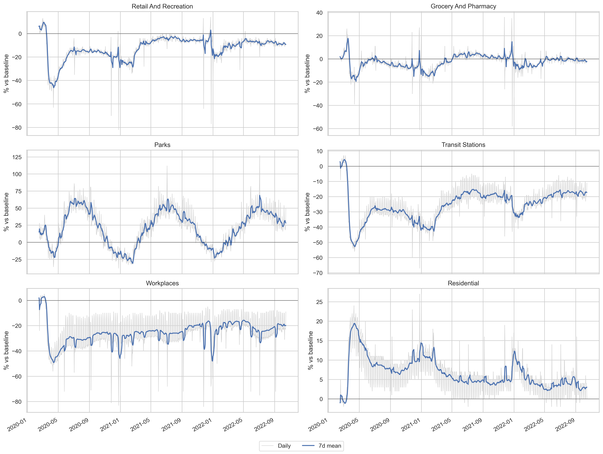
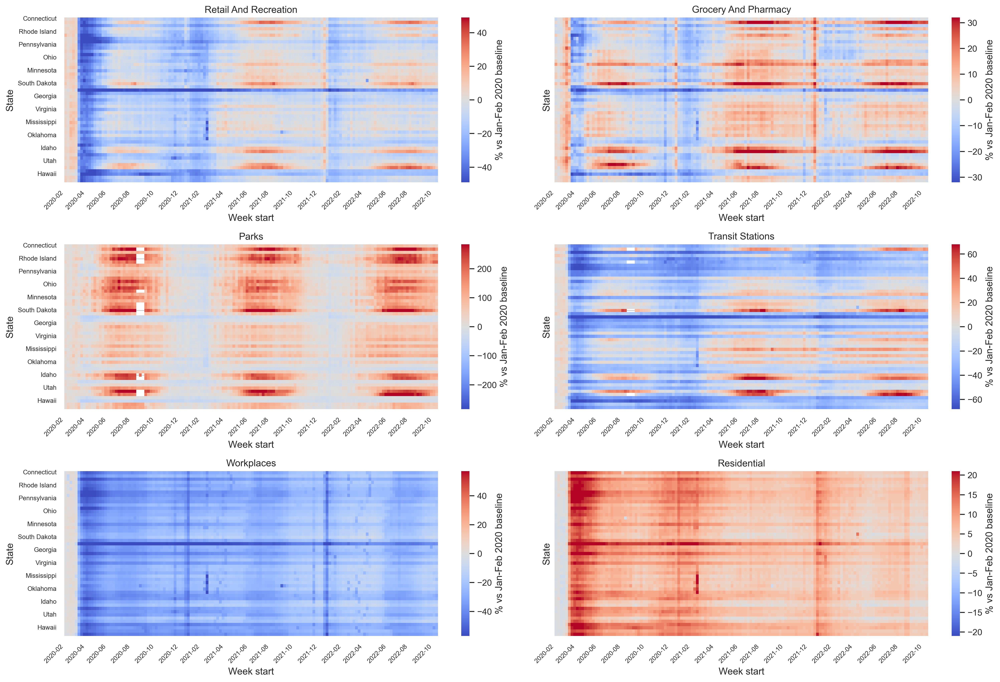

# Hurricane Mobility Analysis

Quantifying how U.S. human mobility patterns shift before, during, and after
hurricane landfalls using Google Community Mobility Reports (2020-2022) and
BTS Daily Mobility Statistics (2019-2024).

## Repository Structure

```
hurricane/
├── data/
│   ├── raw/                          # Original data files (not tracked by git)
│   │   ├── google_mobility/          # Google COVID-19 Community Mobility CSVs
│   │   ├── bts_daily_mobility.csv    # BTS Daily Mobility Statistics
│   │   ├── hurricanes_2019_2024.csv  # Hurricane catalogue
│   │   ├── nst-est2019.csv           # Census population estimates (2019)
│   │   └── NST-EST2024-POP.csv       # Census population estimates (2020-2024)
│   └── processed/                    # Parquet files generated by notebooks
├── notebooks/
│   ├── 01_google_mobility_qc.ipynb   # Ingest, schema QC, export to Parquet
│   ├── 02_google_mobility_eda.ipynb  # EDA: timeseries, heatmaps, event windows
│   ├── 03_external_data_ingest.ipynb # BTS, hurricanes, population → Parquet
│   └── 04_bts_event_analysis.ipynb   # BTS event plots, YoY, baselines
├── src/hurricane_mobility/           # Reusable Python package
│   ├── __init__.py
│   ├── config.py                     # Centralised path constants
│   ├── lookups.py                    # Shared constants and lookup tables
│   ├── loaders.py                    # Data loading functions
│   ├── cleaning.py                   # Data cleaning and optimization
│   ├── features.py                   # Feature engineering (shares, per-capita)
│   └── plotting.py                   # All visualisation functions
├── output/
│   ├── figures/                      # Saved PNG figures
│   └── tables/                       # Exported summary tables
├── tests/                            # Lightweight unit tests
├── docs/
│   └── data_dictionary.md            # Dataset documentation
├── pyproject.toml                    # Package metadata and dependencies
├── environment.yml                   # Conda environment specification
├── requirements.txt                  # pip dependency list
├── Makefile                          # Pipeline automation
├── LICENSE                           # MIT License
└── CITATION.cff                      # Machine-readable citation metadata
```

## Quick Start

### 1. Environment Setup

**Option A — Conda (recommended):**

```bash
conda env create -f environment.yml
conda activate hurricane
```

**Option B — pip:**

```bash
python -m venv .venv && source .venv/bin/activate
pip install -r requirements.txt
pip install -e .
```

### 2. Data Setup

Place the following files in their expected locations:

| File | Location |
|---|---|
| Google Mobility CSVs (2020-2022) | `data/raw/google_mobility/` |
| BTS Daily Mobility CSV | `data/raw/bts_daily_mobility.csv` |
| Hurricane catalogue | `data/raw/hurricanes_2019_2024.csv` |
| Census population 2019 (NST-EST2019) | `data/raw/nst-est2019.csv` |
| Census population 2020-2024 (NST-EST2024-POP) | `data/raw/NST-EST2024-POP.csv` |

### 3. Run the Pipeline

**Using Make:**

```bash
make all          # Full pipeline: NB01 → NB02 → NB03 → NB04
make google       # Google Mobility pipeline (NB01 + NB02)
make bts          # BTS pipeline (NB03 + NB04)
make test         # Run unit tests
make clean        # Remove generated outputs
```

**Or run notebooks manually:**

```bash
jupyter lab notebooks/
```

Run in order: 01 → 02 → 03 → 04.

## Data Sources

- **Google COVID-19 Community Mobility Reports** — Percent change in visits to
  categorised places compared to a Jan-Feb 2020 baseline. Covers 2020-02 to
  2022-10 at national, state, and county levels.
  [Source](https://www.google.com/covid19/mobility/)

- **BTS Daily Mobility Statistics** — Daily trip counts by distance band and
  population movement from the Bureau of Transportation Statistics.
  [Source](https://data.bts.gov/Research-and-Statistics/Trips-by-Distance/w96p-f2qv)

- **Hurricane Landfall Catalogue** — Date, category, and affected states for
  US hurricane landfalls 2019-2024 compiled from NHC advisories.

- **State Population Estimates** — US Census Bureau annual population
  estimates by state. Two files: NST-EST2019 (vintage 2019, provides 2019)
  and NST-EST2024-POP (vintage 2024, provides 2020-2024). Required for
  per-capita metrics.
  [Source](https://www.census.gov/programs-surveys/popest.html)

## Notebooks

| Notebook | Purpose | Key Outputs |
|---|---|---|
| 01 | Google Mobility ingestion and QC | `us_mobility_2020_2022.parquet` |
| 02 | Google Mobility EDA and visualisation | 30+ figures in `output/figures/` |
| 03 | BTS, hurricane, population ingestion | `bts_state_daily.parquet`, `hurricanes_2019_2024.parquet` |
| 04 | BTS event analysis and per-capita metrics | 40+ figures in `output/figures/` |

## Results

A curated selection of headline figures is shown below. The full set of ~60
plots lives in [`output/figures/`](output/figures) and can be browsed directly
on GitHub.

### National mobility timeseries (Google, 2020-2022)



### State × week heatmap



### Event-window mobility — Hurricane Ida (LA, 2021)

.png>)

### Year-over-year comparison — Hurricane Ian (FL, 2022)

.png>)

### Per-capita trips — Hurricane Laura (LA, 2020)

.png>)

> All figures are regenerated by running the notebooks end-to-end
> (`make all`). Tables and intermediate Parquet files are *not* tracked by git;
> see [`.gitignore`](.gitignore).

## Citation

If you use this software, please cite:

```bibtex
@software{hurricane_mobility,
  title  = {Hurricane Mobility Analysis},
  author = {[Author Name]},
  year   = {2025},
  url    = {https://github.com/[owner]/hurricane-mobility}
}
```

See `CITATION.cff` for machine-readable metadata.

## License

This project is licensed under the MIT License — see [LICENSE](LICENSE) for details.
